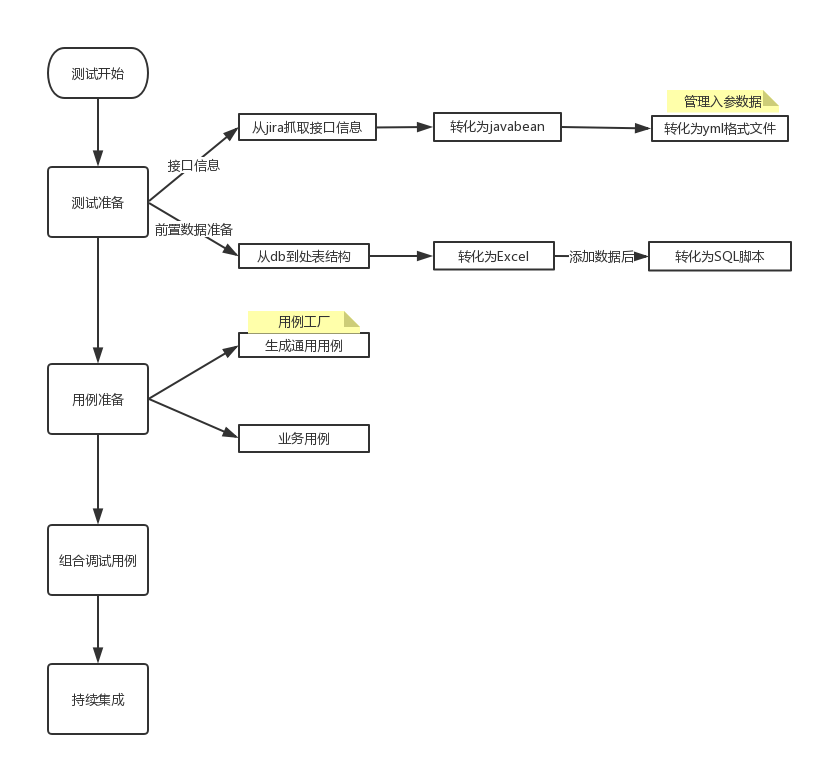

# fast test framework
## original intention of design
Agile development faster and faster pace of interface test from development environment needs to step in debugging stage to complete interface smoke test, the subsequent fast interface test.

## interface workflow

## use technology
1. SpringFramework 4.* (custom test listener)
2. Gradle 3.*
3. TestNG(custom report, custom listener)
4. ExtentReports
5. REST-Assured
6. selenide
7. yml
8. dubbo(泛型调用dubbo接口)

> require [jdk1.8](http://www.oracle.com/technetwork/cn/java/javase/downloads/jdk8-downloads-2133151-zhs.html)

## Design Part
### 构建请求几个要素
1. 请求地址
    - BaseURL
    - RequestPath
    - RequestEnv
2. 认证信息
    - Cookie
    - Token
    - DK
3. 请求参数
    - Map
    - json

### 读取配置方式
- 默认配置（没有指定特定配置,所有请求使用默认配置）
    1. 请求地址，默认情况;
    2. 认证信息，默认情况，默认用户.
- 特定配置（特定信息默认不指定,制定了特定信息,就不在使用默认配置）
    1. 特定请求地址;
    2. 特定认证信息;
    3. 特定参数.
### TestNG组织用例
1. multi suite
2. class
3. method

### 加载用例全流程
1. 读取全局配置（yml）,数据项如下：
    1. BaseURL
    2. UserId
    3. env
2. 读取全局测试数据（yml,excel）,共享数据（所有用例），如：
    1. 用户名
3. 加载单个用例配置（yml）,数据项如下：
    1. URL(BaseURL+Path)
    2. UserId
    3. RequestPath
4. 加载单个用例数据（yml,excel），隔离数据（单个用例），如：
    1. 商品价格
5. 为每个用例构造请求信息
    1. 认证信息
    2. 全路径地址
    3. 参数
6. 验证返回参数

#### 用例实现
1. 重写TestNG IAnnotationTransformer，@Test方法之前设置dataProvider
    1. 缺点：不能实现数据共享，每个case重复的字段都要写一遍
    2. 优点：不用手动组装请求参数
    使用例子：@ZBJTestDataProvider(dataFile="")
2. 使用注解加载测试数据到Ehcache中
    1. 优点：实现数据数据共享
    2. 缺点：每个用例都要手动组装请求数据
    3. @DataFile(Path="", Scope="")
3. 重写TestNG IClassListener方法，执行class用例之前加载配置到ehcache
    1. 测试类执行前，加载测试配置
4. 使用rest-assured方式组装请求

#### 用例编写详细流程
> Given 给定一些条件，When 当执行一些操作时，Then 期望得到某个结果

1. 通过confluence生成yml,testCase. 调用src/main/java/com/whatistest/generate/Generate.java
2. 加载测试数据
2. 选择请求方式
3. 配置请求参数信息
4. 添加断言，可以使用默认的或者使用jsonPath

### 测试数据存放格式
1. 用例只需要一条数据，使用yml. 运用yml特性，数据共享
2. 用例需要使用多条数据，使用excel
3. json

## 提供测试数据准备方式
> 系统提供占位符，添加到数据脚本中，构造数据时，发现存在占位符变替换为相应拉取数据方式

1. 没有依赖的接口
 - 直接将测试数据填写到yml中，多个测试case之间能数据共享的（采用yml的引用）
 - 可以从数据库中拉取某些数据，进行填充
2. 依赖外部数据的接口
 - 调用其他接口返回当前接口数据
 - 插入依赖数据到数据库（即：将调用接口的处理逻辑数据插入数据库）。如果依赖接口是缓存就不好操作

## 支持case前置数据插入/删除操作（目前需要手动切换环境）
运用springframework test module 包括：SQL执行、事务处理（默认自动提交）。使用如下：
1. 继承测试基础类
2. class/method 前添加测试脚本，使用@Sql @SqlConfig @SqlGroup annotation
3. @BeforeTransaction @AfterTransaction 事务前后验证

## 现在接口测试存在的问题或痛点
1. 组织用例过程复杂
2. 接口数据依赖太强
 1. 原始数据
 2. 需要其他接口

## 实现的目标
1. 可用性（组织用例快）
2. 维护性
3. 可扩展性
4. 稳定性
  
## next plan
1. 丰富报告
 - 添加每个用例入参（完成）
2. 丰富入参
 - 插入前置数据(完成)
 - 多环境配置自动加载
 - 自动清理插入的数据（完成）
 - 支持将Excel数据文件自动转换为sql脚本插入前置数据(完成)
 - json入参
 - excel sheetName 入
4. 分离报告与数据装作成模块
5. 支持dubbo接口测试(基本支持)
6. 从数据库获取值验证内容

> author by : rubyvirusqq@gmail.com